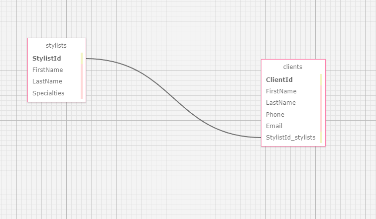

#  Eau Claire's Salon Managament App

#### By: Jason Elijah Church

#### A web application where Eau Claire can store information on her employees and their clients.

## Technologies Used
* C#
* Markdown
* Git Bash
* Razor
* SQL
* MySQL Workbench
* Visual Code Studio
* .NET

## Description:

## Setup/ Installation Requirements

1. Clone this repo.
2. The database structure for this project can be found and recreated by accessing the jason_church.sql file in the root directory. This is a visual representation of the database: 
3. Open your terminal (e.g., Terminal or GitBash) and navigate to this project's production directory called "HairSalon" and create a new file called appsettings.json.
4. Within the appsettings.json file, add this line of code: { "ConnectionStrings": { "DefaultConnection": "Server=localhost;Port=3306;database=jason_church;uid=root;pwd=epicodus;"}}
5. Note: you may have to edit the uid and pwd depending if your username and password are different with mySQL.
6. While in the production folder of this application ("HairSalon"), in the command line, run the command "dotnet watch run" to compile and execute the application.
7. Note: There are no instructions for running tests for this repo because there were no custom methods that needed testing. The HairSalon.Tests directory and its files were just created off a template and don't contain anything aside from boilerplate code.

## Known Bugs
Currently no found bugs, but I ran into an issue figuring out how to route the user back to a stylist's detail page when they create or update a client. The quick fix I implemented was just to route the user back to the Index page of stylists, which contains a list of all the stylists. 

## License

MIT License

Copyright (c) (2023) Jason Elijah Church

Permission is hereby granted, free of charge, to any person obtaining a copy
of this software and associated documentation files (the "Software"), to deal
in the Software without restriction, including without limitation the rights
to use, copy, modify, merge, publish, distribute, sublicense, and/or sell
copies of the Software, and to permit persons to whom the Software is
furnished to do so, subject to the following conditions:

The above copyright notice and this permission notice shall be included in all
copies or substantial portions of the Software.

THE SOFTWARE IS PROVIDED "AS IS", WITHOUT WARRANTY OF ANY KIND, EXPRESS OR
IMPLIED, INCLUDING BUT NOT LIMITED TO THE WARRANTIES OF MERCHANTABILITY,
FITNESS FOR A PARTICULAR PURPOSE AND NONINFRINGEMENT. IN NO EVENT SHALL THE
AUTHORS OR COPYRIGHT HOLDERS BE LIABLE FOR ANY CLAIM, DAMAGES OR OTHER
LIABILITY, WHETHER IN AN ACTION OF CONTRACT, TORT OR OTHERWISE, ARISING FROM,
OUT OF OR IN CONNECTION WITH THE SOFTWARE OR THE USE OR OTHER DEALINGS IN THE
SOFTWARE.
